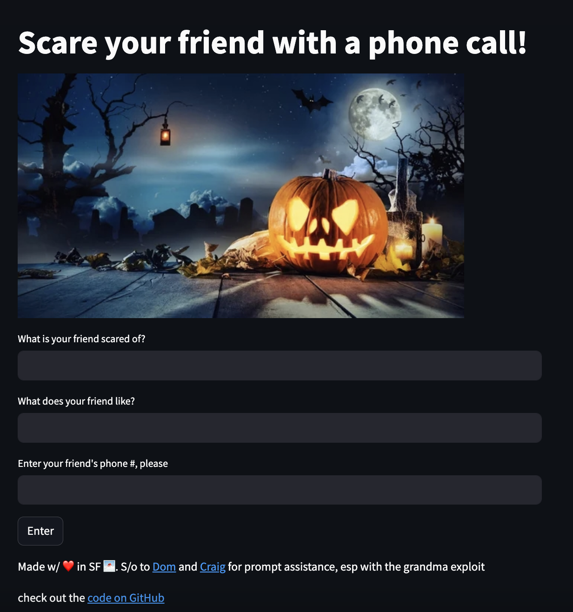

### Happy Halloween! Make a scary phone call with AI (llama-2-70b-chat)
[Try out the web app here](https://ai-halloween-story-phone-call.streamlit.app/)

- [get your Twilio credentials here and a phone number here](https://twilio.com/try-twilio) to send the SMS and Phone call
- [make a Replicate account here](https://replicate.com/) to use LLaMA 2 70b-chat
- [make a Streamlit account here](https://streamlit.io/) to build the web app in Python (and take in user input of phone #, what they're scared of, what they like...)
- [make a Metaphor account here](https://metaphor.systems/) to perform LLM-powered search for relevant scary stories according to the user input
Clone the repo, install the dependencies by running `pip install -r requirements.txt`, and make a directory `.streamlit` containing a file with your credentials called `secrets.toml`.

This app uses the Amazon Polly Brian voice--[you can replace it with one of the voices here if you wish](https://docs.aws.amazon.com/polly/latest/dg/voicelist.html). It also edits the voice with SSML tags like prosody--more info on those found [here in the Twilio docs](https://www.twilio.com/docs/voice/twiml/say/text-speech). 

[Related Tiktok tutorial is found here if that's more your speed](https://www.tiktok.com/@lizziepikachu/video/7159333251348172075)